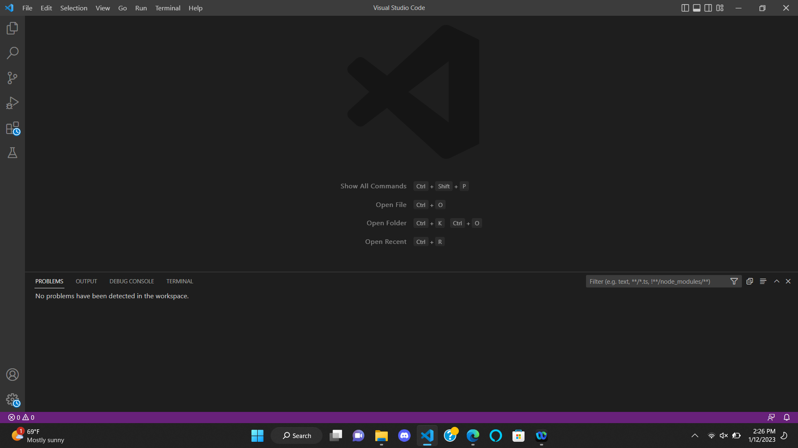
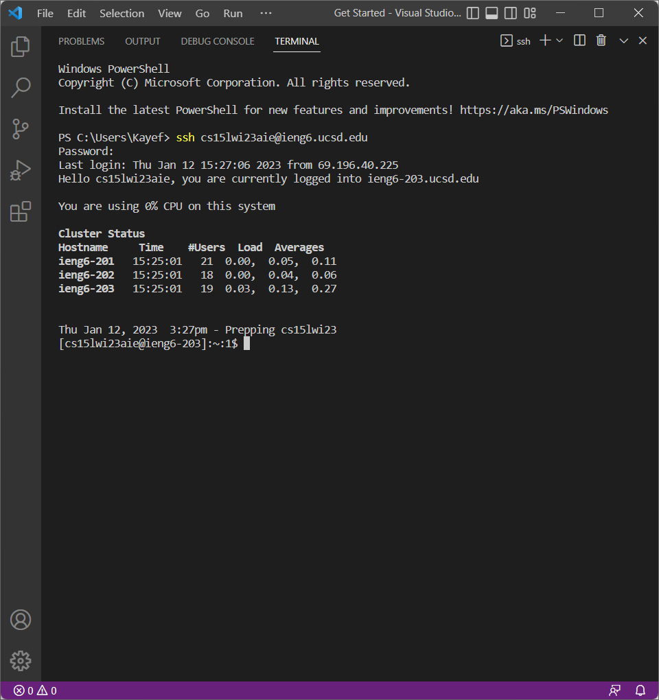
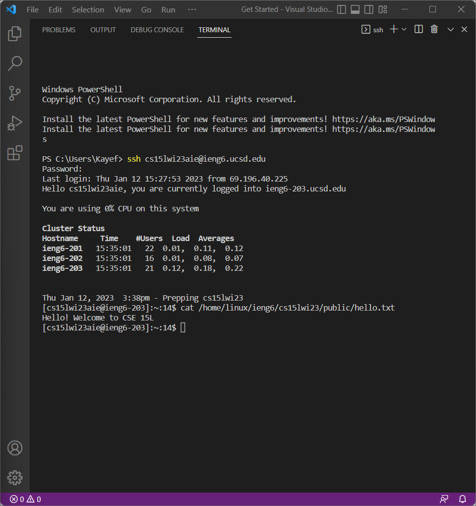

# **Lab Report 1**

## Part 1: How to Install Visual Studio Code

Go to the Visual Studio Code website, [Link]https://code.visualstudio.com, and follow the directions provided in order to download and install the application onto your device

When installed, you should be able to open up a window that will look like this: 



Hooray! You now have Visual Studio Code Installed!

---

## Part 2: Remotely Connecting

Today, we will see how to use VSCode/terminal to connect to a remote computer over the internet to do work!

**Note:** if you're working on Windows, you will need to instal `git` for Windows, which comes with useful tools that we will be using in this course.

Here is the link to install `git` for Windows: [Link]https://gitforwindows.org.

Once installed, open a new terminal in VSCode by using either Ctrl/Command-+ or by clicking through the menu options. There, we will be using your newly-installed `git bash`.

Here is the command to use `ssh`:

`$ ssh cs15lwi23zz@ieng6.ucsd.edu`

Your command will look a little different as the `zz` will be the letters in your course-specific account.

Since this is likely your first time connecting to this server, you will most likely receive this message: 

```
⤇ ssh cs15lwi23zz@ieng6.ucsd.edu
The authenticity of host 'ieng6.ucsd.edu (128.54.70.227)' can't be established.
RSA key fingerprint is SHA256:ksruYwhnYH+sySHnHAtLUHngrPEyZTDl/1x99wUQcec.
Are you sure you want to continue connecting (yes/no/[fingerprint])?
```

You will want to type `yes` into the terminal and press enter, which will then prompt you to enter your password. After logging on, your screen should look something like this: 



Woohoo! Now your terminal is connected to a computer in the CSE basement, and any commands that you run will run on that computer! 

**Note**: It's okay to run into errors while following this tutorial, so make sure to ask your fellow peers for help!

---

## Part 3: Testing Commands 

If you've reached this far, that means you have completed the previous two steps above. Congrats! Now we can try running some commands on both **your computer**, and on the **remote computer** aftering ssh-ing. 

Try running the commands `cd`, `ls`, `pwd`, `mkdir`, and `cp` a few times and in a few different ways. See what results the terminal provides and see what they mean!

Here's a list of some specific useful commands to try: 

* `cd ~`
* `cd`
* `ls -lat`
* `ls -a`
* `ls <directory>` where `<directory>` is `/home/linux/ieng6/cs15lwi23/cs15lwi23abc`, where the `abc` is one of the other group members’ username
* `cp /home/linux/ieng6/cs15lwi23/public/hello.txt ~/`
* `cat /home/linux/ieng6/cs15lwi23/public/hello.txt`

I tested out `cat /home/linux/ieng6/cs15lwi23/public/hello.txt` and got the following result below: 



After trying out all those commands, we can log out of the remote server in your terminal by using: 

* Ctrl-D
* Run the command `exit`
