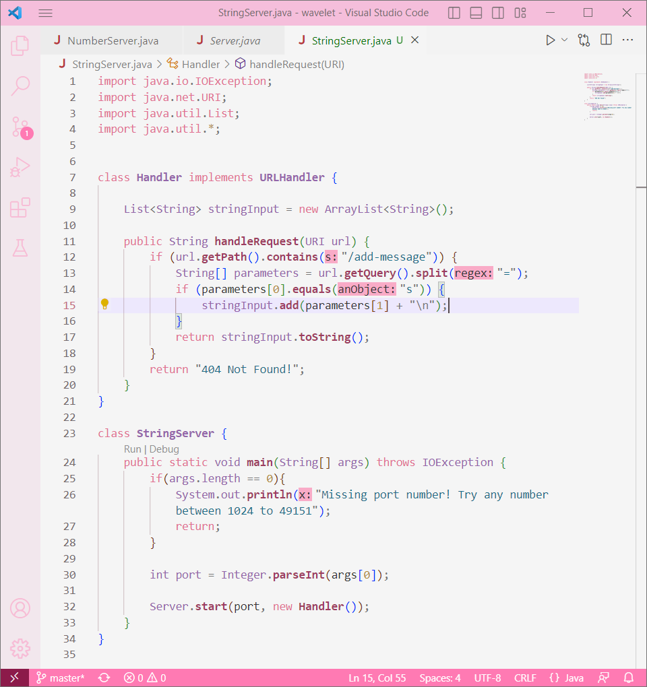
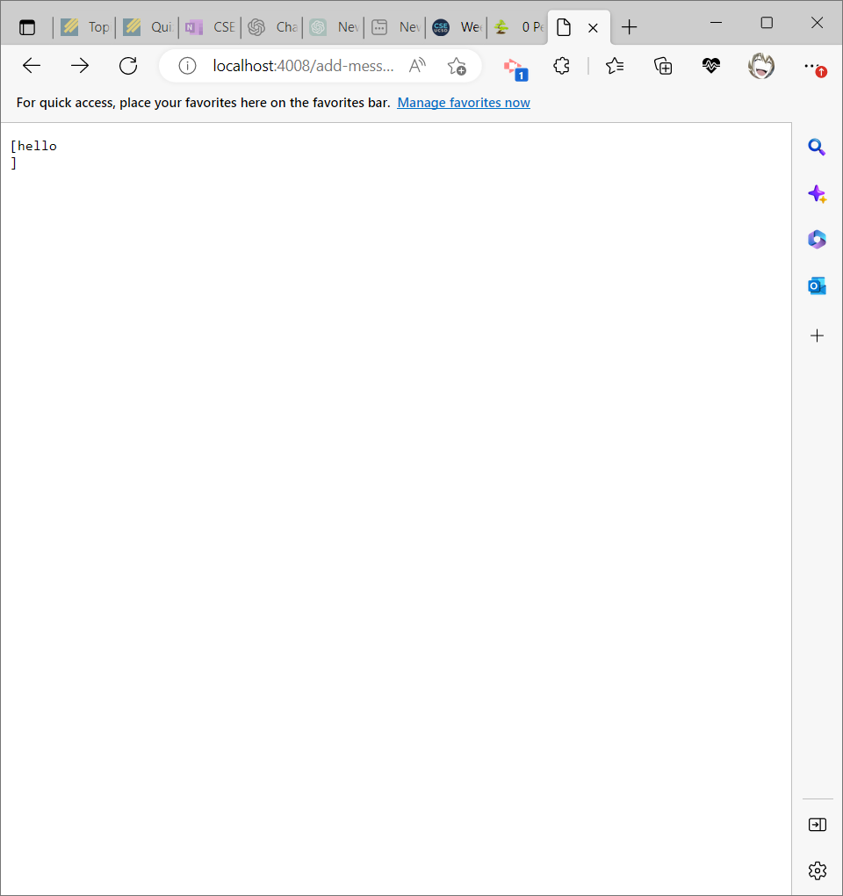
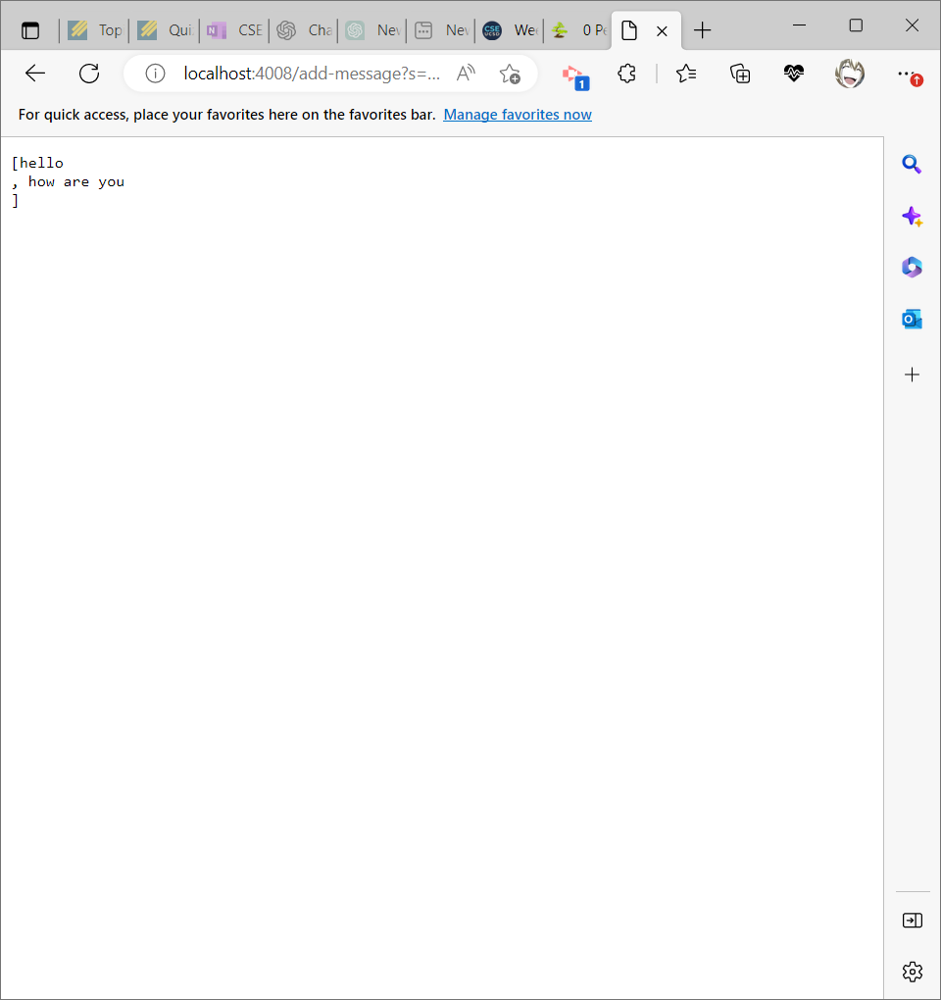
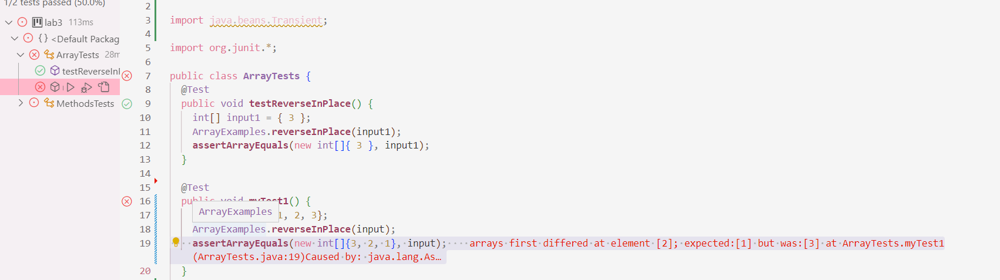

# Lab Report 2 - Servers and Bugs (Week 3)

## Part 1: Web Servers!

Below is my code that creates a web server called `StringServer` that keeps track of a single string that gets appended by incoming requests. 



This is what the request looks like: 
`/add-message?s=<string>`

The effect of this request is to concatenate a new line (`\n`) and the string after the `=` to the running string, and then respond with the entire string 

For example, after 
`/add-message?s=hello`

This is what the page displays:



In order for my web server to display this output, `handleRequest(URI url)` first checks to see if the URL path contains the following `/add-message` by using `getPath()`. These are `String` methods that are checking the URL that we have created. If the URL contains the following path, `getQuery()` and `split()` are then called in order to separate the request and the following string that we are trying to concatenate. To be more specific, these methods are splitting `s=<string>` at the `=` and storing them into an array so that we can correctly concatenate the running string by using `add()`. As a result, our `String` array named, `parameters`, will have our query `s` and our running string stored. Each running string is stored into an ArrayList that I have created named , `stringInput`, which then gets returned as a `toString()` at the very end.

After adding
`/add-message?s=how are you`

the page displays 



Similar to how we added `hello` in the beginning, `how are you` is then concatenated to a new line after being stored into `stringInput`, taking the value of `parameters[1]` instead of `hello`. `stringInput` and the URL will continuously change with every running string that we request to add. 

**Note:** My web server displays the single strings added in between brackets and separated by commas because in my code, I add each string onto a created ArrayList and returning the value stored in that list as a string, hence using the `toString()` method! Regardless, my webserver is producing the same result!

---
## Part 2: Bugs

One bug from lab 3 was our `reverseInPlace()` method used in our `ArrayExamples` class!

A failure-inducing input for the buggy program:

```
@Test
public void testReverseInPlace() {
  int [] input = { 1, 2, 3 };
  ArrayExampes.reverseInPlace(input);
  assertArrayEquals(new int[]{ 3, 2, 1 };
}
```

The actual output of this program is `3, 2, 3` when the expected output of this program should have been `3, 2, 1`.

An input that doesn’t induce a failure:

```
@Test
public void testReverseInPlace() {
  int [] input = { 3 };
  ArrayExampes.reverseInPlace(input);
  assertArrayEquals(new int[]{ 3 };
}

```

Both the expected and actual output of this code is `3`

The symptom, as the output of running the tests (provide it as a screenshot of running JUnit with at least the two inputs above)



The bug, as the before-and-after code change required to fix it:

Before fix: 

```
public class ArrayExamples {
 static void reverseInPlace(int[] arr) {
    for(int i = 0; i < arr.length; i += 1) {
      arr[i] = arr[arr.length - i - 1];
    }
  }
}
  
```

After fix: 

```
pubic class ArrayExamples {
 static void reverseInPlace(int[] arr) {
    for(int i = 0; i < arr.length/2; i += 1) {
      int placeHolder = arr[i];
      arr[i] = arr[arr.length - i - 1];
      arr[arr.length - i - 1] = placeHolder;
    } 
  }
}
```

Initially, when we tried to use the `reverseInPlace()` method, we see that the original array is being overwritten, so by the time we reach the second half of the list, we can only return the overwritten values, hence when we try to reverse `1, 2, 3`, we end up getting `3, 2, 3`. To fix this bug, we can create a temporary variable to store the first half of the array so that it does not allow them to be overwritten in the process of swapping elements.

---
## Part 3: Recap

Something that I did not know before was creating web servers! It was quite confusing to navigate around in the beginning, but as I got to better understand how the code works, I was able to play around and create other search engines that have multiple functionalities :D! 

