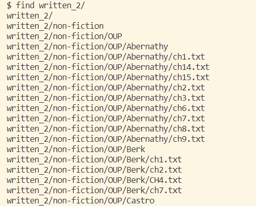

# Lab Report 3 - Researching Commands

Today, I will be using the `find <<directory-path>>` command! `find` takes a directory path as an argument and lists all the files and directories that are inside that directory.

For example, during lab, we utilzed `find` and had `./written_2` as our argument in order to find all the files located in that directory path. 

Here's what it would look like:



Our output when doing `find written_2/` produces this super long list of all the files that are stored in that directory path!

In addition, we can utilze `find` in many other ways with the use of **command-line options**!

Four **command-line options** that I will be delving into are:
- `-name`
- `-type`
- `-size`
- `-user`

---

`-name` is an option that allows us to search for files with a specific name. This command-line takes in a file name as the argument and will search for that file and return the location of where it's stored. This can be useful for situations where we may know the filename, but not so sure where it's stored!

One way we can use `-name` is by doing the following:

`$ find written_2/ -name "HandRHawaii.txt"`

The generated output for this command is: 

`written_2/travel_guides/berlitz1/HandRHawaii.txt`

Here, we are trying to find where the file `HandRHawaii.txt` in the `written_2` directory is. When doing so, the output tell us the location of the file, with it being in the `berlitz1`, which is located in the `travel_guides` subdirectory.

Another way is:

`$ find written_2/ -name "ch1.txt"`

The generated output for this command is: 

```
written_2/non-fiction/OUP/Abernathy/ch1.txt
written_2/non-fiction/OUP/Berk/ch1.txt
written_2/non-fiction/OUP/Fletcher/ch1.txt
written_2/non-fiction/OUP/Kauffman/ch1.txt
written_2/non-fiction/OUP/Rybczynski/ch1.txt
```
Similar to what we did earlier, when searching for `ch1.txt`, we are given all the directories that they are located in!

This command-line option was found using ChatGPT!

---

`-type` is an option that allows us to search for a specific type of file. The types of files that we can search for are:

- `f` regular files
- `d` directories
- `l` symbolic links
- `c` charcter devices
- `b` block devices
- `p` named pipes
- `s` sockets

This option can be quite useful when it comes to situations where we need to find a file of a certain type, so this really helps us narrow down and easily find what we need!

One way to use type is:

`$ find written_2/ -type d`

The generated output for this command is: 

```
written_2/
written_2/non-fiction
written_2/non-fiction/OUP
written_2/non-fiction/OUP/Abernathy
written_2/non-fiction/OUP/Berk
written_2/non-fiction/OUP/Castro
written_2/non-fiction/OUP/Fletcher
written_2/non-fiction/OUP/Kauffman
written_2/non-fiction/OUP/Rybczynski
written_2/travel_guides
written_2/travel_guides/berlitz1
written_2/travel_guides/berlitz2
```

When doing `-type d`, this command-line generated an output that listed all the types of files that are directories in `./written_2`!

Another way of using `-type` is:

`$ find written_2/ -type f`

Here, we get a really long output that takes up a lot of the terminal, so I will be showing just a portion of the output:

```
written_2/non-fiction/OUP/Abernathy/ch1.txt
written_2/non-fiction/OUP/Abernathy/ch14.txt
written_2/non-fiction/OUP/Abernathy/ch15.txt
written_2/non-fiction/OUP/Abernathy/ch2.txt
written_2/non-fiction/OUP/Abernathy/ch3.txt
written_2/non-fiction/OUP/Abernathy/ch6.txt
written_2/non-fiction/OUP/Abernathy/ch7.txt
written_2/non-fiction/OUP/Abernathy/ch8.txt
written_2/non-fiction/OUP/Abernathy/ch9.txt
written_2/non-fiction/OUP/Berk/ch1.txt
written_2/non-fiction/OUP/Berk/ch2.txt
written_2/non-fiction/OUP/Berk/CH4.txt
written_2/non-fiction/OUP/Berk/ch7.txt
written_2/non-fiction/OUP/Castro/chA.txt
written_2/non-fiction/OUP/Castro/chB.txt
written_2/non-fiction/OUP/Castro/chC.txt
written_2/non-fiction/OUP/Castro/chL.txt
written_2/non-fiction/OUP/Castro/chM.txt
written_2/non-fiction/OUP/Castro/chN.txt
written_2/non-fiction/OUP/Castro/chO.txt
written_2/non-fiction/OUP/Castro/chP.txt
written_2/non-fiction/OUP/Castro/chQ.txt
written_2/non-fiction/OUP/Castro/chR.txt
written_2/non-fiction/OUP/Castro/chV.txt
written_2/non-fiction/OUP/Castro/chW.txt
written_2/non-fiction/OUP/Castro/chY.txt
written_2/non-fiction/OUP/Castro/chZ.txt
written_2/non-fiction/OUP/Fletcher/ch1.txt
written_2/non-fiction/OUP/Fletcher/ch10.txt
written_2/non-fiction/OUP/Fletcher/ch2.txt
written_2/non-fiction/OUP/Fletcher/ch5.txt
written_2/non-fiction/OUP/Fletcher/ch6.txt
written_2/non-fiction/OUP/Fletcher/ch9.txt
written_2/non-fiction/OUP/Kauffman/ch1.txt
written_2/non-fiction/OUP/Kauffman/ch10.txt
written_2/non-fiction/OUP/Kauffman/ch3.txt
written_2/non-fiction/OUP/Kauffman/ch4.txt
written_2/non-fiction/OUP/Kauffman/ch5.txt
written_2/non-fiction/OUP/Kauffman/ch6.txt
written_2/non-fiction/OUP/Kauffman/ch7.txt
written_2/non-fiction/OUP/Kauffman/ch8.txt
written_2/non-fiction/OUP/Kauffman/ch9.txt
written_2/non-fiction/OUP/Rybczynski/ch1.txt
written_2/non-fiction/OUP/Rybczynski/ch2.txt
written_2/non-fiction/OUP/Rybczynski/ch3.txt
```
By doing `type f` we are searching for all the regular files located in `./written-2`. In the code block above, these are all the regular files located in `OUP` of the `non-fiction` subdirectory.

This command-line option was found using ChatGPT!

---

`-size` is an option that allows us to find files based on the file size. They types of sizes that we can specify are:

- `b` 512-byte blocks
- `c` bytes
- `w` two-byte words
- `k` Kilobytes
- `M` Megabytes
- `G` Gigabytes

This command line can be quite useful in situations where we need to find files that fit certain size criterias!

One way we can use `-size` is:

`$ find written_2/ -size +512b`

Which generates the output:

`written_2/travel_guides/berlitz1/WhereToItaly.txt`

Here, we are looking in `./written_2` for files that are larger (hence the `+` before the numerical value) than 512 bytes. The output shown is the file **larger** than 512 bytes and its location.

Another way of using size is: 

`$ find written_2/ -size -512b`

Which generates the following output: 

```
written_2/
written_2/non-fiction
written_2/non-fiction/OUP
written_2/non-fiction/OUP/Abernathy
written_2/non-fiction/OUP/Abernathy/ch1.txt
written_2/non-fiction/OUP/Abernathy/ch14.txt
written_2/non-fiction/OUP/Abernathy/ch15.txt
written_2/non-fiction/OUP/Abernathy/ch2.txt
written_2/non-fiction/OUP/Abernathy/ch3.txt
written_2/non-fiction/OUP/Abernathy/ch6.txt
written_2/non-fiction/OUP/Abernathy/ch7.txt
written_2/non-fiction/OUP/Abernathy/ch8.txt
written_2/non-fiction/OUP/Abernathy/ch9.txt
written_2/non-fiction/OUP/Berk
written_2/non-fiction/OUP/Berk/ch1.txt
written_2/non-fiction/OUP/Berk/ch2.txt
written_2/non-fiction/OUP/Berk/CH4.txt
written_2/non-fiction/OUP/Berk/ch7.txt
written_2/non-fiction/OUP/Castro
written_2/non-fiction/OUP/Castro/chA.txt
written_2/non-fiction/OUP/Castro/chB.txt
written_2/non-fiction/OUP/Castro/chC.txt
written_2/non-fiction/OUP/Castro/chL.txt
written_2/non-fiction/OUP/Castro/chM.txt
written_2/non-fiction/OUP/Castro/chN.txt
written_2/non-fiction/OUP/Castro/chO.txt
written_2/non-fiction/OUP/Castro/chP.txt
written_2/non-fiction/OUP/Castro/chQ.txt
written_2/non-fiction/OUP/Castro/chR.txt
written_2/non-fiction/OUP/Castro/chV.txt
written_2/non-fiction/OUP/Castro/chW.txt
written_2/non-fiction/OUP/Castro/chY.txt
written_2/non-fiction/OUP/Castro/chZ.txt
written_2/non-fiction/OUP/Fletcher
written_2/non-fiction/OUP/Fletcher/ch1.txt
written_2/non-fiction/OUP/Fletcher/ch10.txt
written_2/non-fiction/OUP/Fletcher/ch2.txt
written_2/non-fiction/OUP/Fletcher/ch5.txt
written_2/non-fiction/OUP/Fletcher/ch6.txt
written_2/non-fiction/OUP/Fletcher/ch9.txt
written_2/non-fiction/OUP/Kauffman
written_2/non-fiction/OUP/Kauffman/ch1.txt
written_2/non-fiction/OUP/Kauffman/ch10.txt
written_2/non-fiction/OUP/Kauffman/ch3.txt
written_2/non-fiction/OUP/Kauffman/ch4.txt
written_2/non-fiction/OUP/Kauffman/ch5.txt
written_2/non-fiction/OUP/Kauffman/ch6.txt
written_2/non-fiction/OUP/Kauffman/ch7.txt
written_2/non-fiction/OUP/Kauffman/ch8.txt
written_2/non-fiction/OUP/Kauffman/ch9.txt
written_2/non-fiction/OUP/Rybczynski
written_2/non-fiction/OUP/Rybczynski/ch1.txt
written_2/non-fiction/OUP/Rybczynski/ch2.txt
written_2/non-fiction/OUP/Rybczynski/ch3.txt
```
Here, the output was also a very long list of files, so I only included the files just from the `non-fiction` directory!. Similar to the first example we had above, this command instead uses `-` to find the files whose size is **smaller** than the given value.

This information was found at this following [website](https://linuxize.com/post/how-to-find-files-in-linux-using-the-command-line/)!

---

`-user` is an option where we can find files owned by a specific user or group. This file takes in a user name and returns a list of files owned by the user if available. This command-line option is useful because it allows us to locate files that can belong to us or another user when it comes to situations such as troubleshooting!

One way of using it can be:

`$ find written_2/ -user Kayef`

Which generates the following output:

```
written_2/travel_guides/berlitz2
written_2/travel_guides/berlitz2/Algarve-History.txt
written_2/travel_guides/berlitz2/Algarve-Intro.txt
written_2/travel_guides/berlitz2/Algarve-WhatToDo.txt
written_2/travel_guides/berlitz2/Algarve-WhereToGo.txt
written_2/travel_guides/berlitz2/Amsterdam-History.txt
written_2/travel_guides/berlitz2/Amsterdam-Intro.txt
written_2/travel_guides/berlitz2/Amsterdam-WhatToDo.txt
written_2/travel_guides/berlitz2/Amsterdam-WhereToGo.txt        
written_2/travel_guides/berlitz2/Athens-History.txt
written_2/travel_guides/berlitz2/Athens-Intro.txt
written_2/travel_guides/berlitz2/Athens-WhatToDo.txt
written_2/travel_guides/berlitz2/Athens-WhereToGo.txt
written_2/travel_guides/berlitz2/Bahamas-History.txt
written_2/travel_guides/berlitz2/Bahamas-Intro.txt
written_2/travel_guides/berlitz2/Bahamas-WhatToDo.txt
written_2/travel_guides/berlitz2/Bahamas-WhereToGo.txt
written_2/travel_guides/berlitz2/Bali-History.txt
written_2/travel_guides/berlitz2/Bali-WhatToDo.txt
written_2/travel_guides/berlitz2/Bali-WhereToGo.txt
written_2/travel_guides/berlitz2/Barcelona-History.txt
written_2/travel_guides/berlitz2/Barcelona-WhatToDo.txt
written_2/travel_guides/berlitz2/Barcelona-WhereToGo.txt        
written_2/travel_guides/berlitz2/Beijing-History.txt
written_2/travel_guides/berlitz2/Beijing-WhatToDo.txt
written_2/travel_guides/berlitz2/Beijing-WhereToGo.txt
written_2/travel_guides/berlitz2/Berlin-History.txt
written_2/travel_guides/berlitz2/Berlin-WhatToDo.txt
written_2/travel_guides/berlitz2/Berlin-WhereToGo.txt
written_2/travel_guides/berlitz2/Bermuda-history.txt
written_2/travel_guides/berlitz2/Bermuda-WhatToDo.txt
written_2/travel_guides/berlitz2/Bermuda-WhereToGo.txt
written_2/travel_guides/berlitz2/Boston-WhereToGo.txt
written_2/travel_guides/berlitz2/Budapest-History.txt
written_2/travel_guides/berlitz2/Budapest-WhatToDo.txt
written_2/travel_guides/berlitz2/Budapest-WhereoGo.txt
written_2/travel_guides/berlitz2/California-History.txt
written_2/travel_guides/berlitz2/California-WhatToDo.txt
written_2/travel_guides/berlitz2/California-WhereToGo.txt       
written_2/travel_guides/berlitz2/Canada-History.txt
written_2/travel_guides/berlitz2/Canada-WhereToGo.txt
written_2/travel_guides/berlitz2/CanaryIslands-History.txt      
written_2/travel_guides/berlitz2/CanaryIslands-WhatToDo.txt     
written_2/travel_guides/berlitz2/CanaryIslands-WhereToGo.txt    
written_2/travel_guides/berlitz2/Cancun-History.txt
written_2/travel_guides/berlitz2/Cancun-WhatToDo.txt
written_2/travel_guides/berlitz2/Cancun-WhereToGo.txt
written_2/travel_guides/berlitz2/China-History.txt
written_2/travel_guides/berlitz2/China-WhatToDo.txt
written_2/travel_guides/berlitz2/China-WhereToGo.txt
written_2/travel_guides/berlitz2/Costa-History.txt
written_2/travel_guides/berlitz2/Costa-WhatToDo.txt
written_2/travel_guides/berlitz2/Costa-WhereToGo.txt
written_2/travel_guides/berlitz2/CostaBlanca-History.txt        
written_2/travel_guides/berlitz2/CostaBlanca-WhatToDo.txt
written_2/travel_guides/berlitz2/Crete-History.txt
written_2/travel_guides/berlitz2/Crete-WhatToDo.txt
written_2/travel_guides/berlitz2/Crete-WhereToGo.txt
written_2/travel_guides/berlitz2/CstaBlanca-WhereToGo.txt       
written_2/travel_guides/berlitz2/Cuba-History.txt
written_2/travel_guides/berlitz2/Cuba-WhatToDo.txt
written_2/travel_guides/berlitz2/Cuba-WhereToGo.txt
written_2/travel_guides/berlitz2/Nepal-History.txt
written_2/travel_guides/berlitz2/Nepal-WhatToDo.txt
written_2/travel_guides/berlitz2/Nepal-WhereToGo.txt
written_2/travel_guides/berlitz2/NewOrleans-History.txt
written_2/travel_guides/berlitz2/Paris-WhatToDo.txt
written_2/travel_guides/berlitz2/Paris-WhereToGo.txt
written_2/travel_guides/berlitz2/Poland-History.txt
written_2/travel_guides/berlitz2/Poland-WhatToDo.txt
written_2/travel_guides/berlitz2/Portugal-History.txt
written_2/travel_guides/berlitz2/Portugal-WhatToDo.txt
written_2/travel_guides/berlitz2/Portugal-WhereToGo.txt
written_2/travel_guides/berlitz2/PuertoRico-History.txt
written_2/travel_guides/berlitz2/PuertoRico-WhatToDo.txt        
written_2/travel_guides/berlitz2/PuertoRico-WhereToGo.txt
written_2/travel_guides/berlitz2/Vallarta-History.txt
written_2/travel_guides/berlitz2/Vallarta-WhatToDo.txt
written_2/travel_guides/berlitz2/Vallarta-WhereToGo.txt
```
I condensed the output in this example because the list generated showed all of the files in `./written_2`, which is really long; however, because I cloned my own copy of `./written_2`, I basically own all the files!

This option was found through this [website](https://linuxize.com/post/how-to-find-files-in-linux-using-the-command-line/)!

