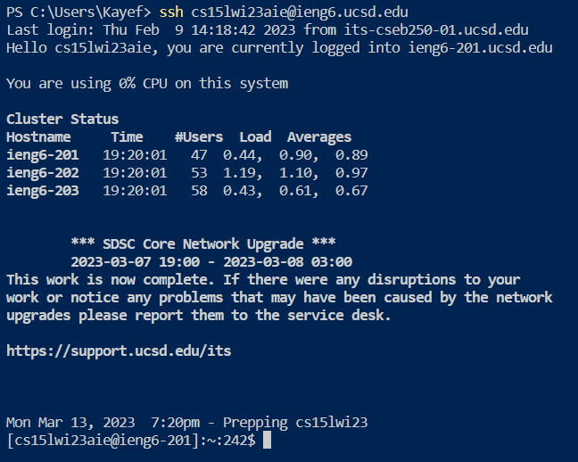
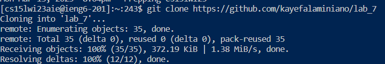
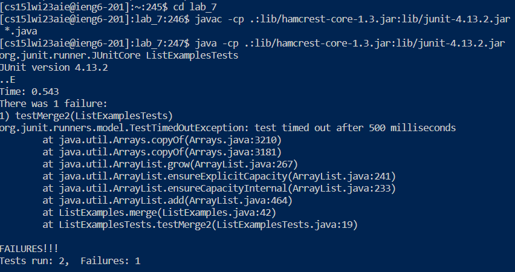
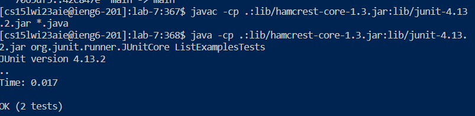
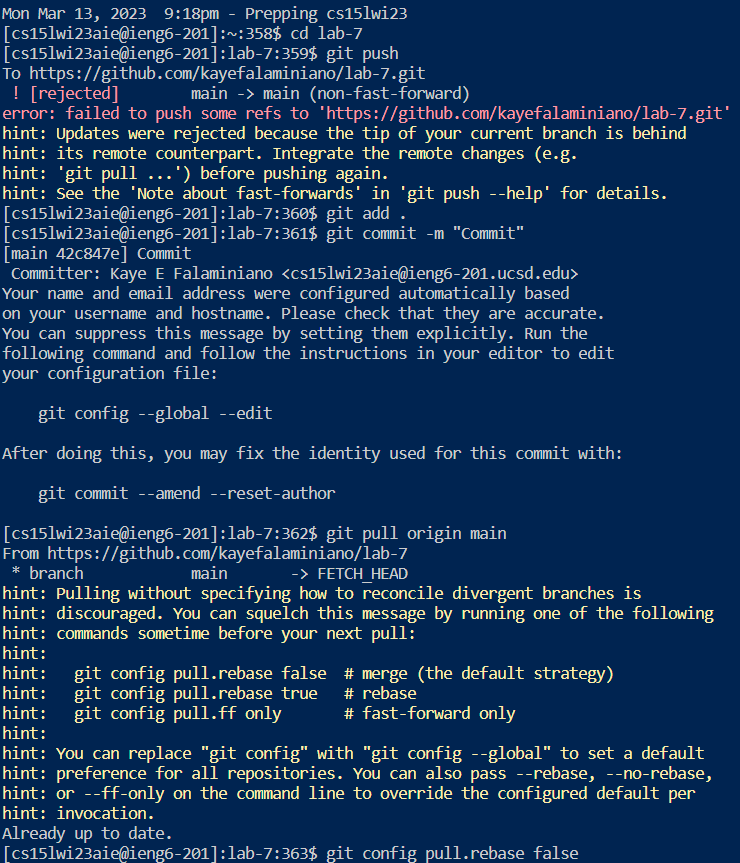
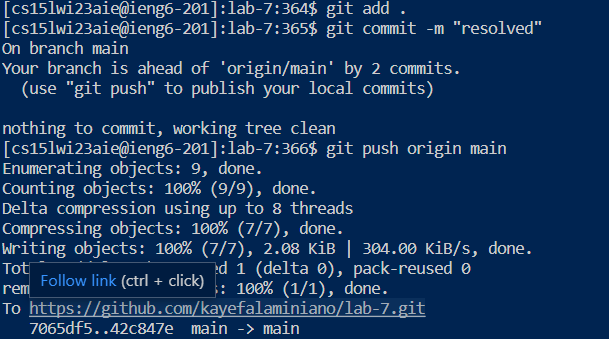

## Lab Report 4 - Github and Login Command-Line Setup

Each time we log into out course-specific account, we always had to type in our password. However, during lab 7, we learned how to configure our own SSH key so that we won't be prompted for a password everytime we log in to our accounts!

In addition, we also learned some **keyboard shortcuts** as well as a helpful tool, known as **auto completion**, to help us easily edit commands! 

**Some keys for auto completion include:**
* **Up/down arrows** to go through the history of commands that have been executed. This makes executing the same commands a lot easier as we don't have to type the same command over and over again, especially if they're *really* long!
* **Tab** key to speed up typing commands in the command line in the following ways:
  * Start typing the first few letters of a command or path. Pressing tab once will autofill the rest of the line up to the point where there are multiple potential possibilities. If you press tab a second time, it will show you all of the possibilities for what it could autocomplete to.

**Some keyboard shortcuts include:**
* `Ctrl-U` deletes everything from the current cursor position to the beginning of the line
* `Ctrl-K` deletes everything from the current cursor position to the end of the line
* `Ctrl-A` goes back to the beginning of the line
* `Ctrl-E` goes to the end of the line
* `Ctrl-W` deletes the last word
* `Alt-Left/Alt-Right` (Windows) or `Option-Left/Option-Right` (Mac) to move by word
* Click the “left” or “right” arrow to go to the left/right end of any selection!

**Quick Copy/Paste**
* **Double click** – selects an entire word
* **Triple click** - selects an entire paragraph
* `Alt+Shift-Left/Alt+Shift-Right` (Windows) or `Option+Shift-Left/Option+Shift-Right` (Mac) - select multiple words
  
  On Mac:
    * Command-C to copy
    * Command-V to paste

  On Windows:
    * Ctrl-C to copy
    * Ctrl-V to paste
    * **Right click** to paste in Windows terminal

With that in mind, we can use these helpful shortcuts in order to complete some tasks!

1. First, we want to log into our ieng6. Since we learned how to configure our own SSH key, whenever we log in, we won't be prompted to enter a password! Here's how it would look:



Because I tried out this task earlier, the command was saved in the bash history! They key I had to press was `<up><enter>`. My login command, `ssh cs15lwi23aie@ieng6.ucsd.edu`, was 1 up in the search history, so I used the **up arrow** to access it!

2. After logging in, we can clone the forked repository from my Github account.



To copy and paste the forked repository, I used `Ctrl-C` to copy the Github link, and then **right clicked** to paste into the Windows terminal. 

3. We can then `cd` into my `lab_7` directory and run the java commands in order to run the JUNIT tests. 



Here we can see that we failed one test, with the error being on line 42 of `ListExamples.java`. To perform this command, rather than typing out the whole java commands, I instead pressed `<up><up><up><up><up><enter>` to compile the code and then `<up><up><up><up><up><enter>` to run it. The `javac -cp .:lib/hamcrest-core-1.3.jar:lib/junit-4.13.2.jar *.java` command was 5 up in the search history, so I used up arrow to access it. Then the `java -cp .:lib/hamcrest-core-1.3.jar:lib/junit-4.13.2.jar org.junit.runner.JUnitCore` command was 5 up in the history, so I accessed and ran it in the same way.

To fix the failing test, we can change line the error by changing `index1 += 1` to `index2 += 1` so that we no longer get the error of an infinite loop!

```
 while(index2 < list2.size()) {
      result.add(list2.get(index2));
      index2 += 1;
```

After pushing the changes, we see that we pass the tests!



In order to retest my code, I pressed the keys `<up><up><up><up><up><up><enter>` to compile the code again, and `<up><up><up><up><up><enter>` to then run it (similar to what I did earlier!)
  
Commiting and pushing the changes to my Github account was the most difficult part. Here's how I did it:
  


  
I came across so many errors while committing and pushing, so I ended up asking chatGPT to help me navigate through my issues and problems and after a frustrating hour, I finally committed it!!!

