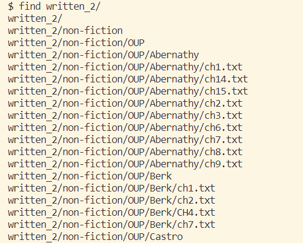

## Lab Report 5 - More Command-Line Options!

Referring back to our previous lab, lab 3, we researched and learned about **command-line options** such as `find`/`grep`. 

As a refresher, `find` takes a directory path as an argument and lists all the files and directories that are inside that directory. During lab, we utilzed `find` and had ./written_2 as our argument in order to find all the files located in that directory path. Here's how it would look:



Our output when doing `find written_2/` produces this super long list of all the files that are stored in that directory path!

In my previous lab report, I mentioned four **command-line arguments**, which included `-name`, `-type`, `-size`, and `-user`. These options allow us to narrow down our findings when searching for specific things in files.

Today, I will be introducing a some useful command-line options for `grep`! `grep` takes a string and a file, and prints out all the lines in that file that match to that string. If we try:

`grep ".txt" find-results.txt`

we get another long list of files that are located within `written_2/`!

Some command-line options that we can use with `grep` include:
* `-m`
* `-n`
* `-c`
* `-i`

*All of these command-line options were found with the help of chatGPT!*

---

The option `-m` allows us to specify a maximum number of lines to be matched for each input file. This is useuful for when we want to limit the amount of output produced, as they can be *reallyyyyy* long! To use `-m`, we simply specify the number of lines that are going to be matched with a **search term** - a string input that will be searched for within the file.

When we run `$ grep -m 2 "city" written_2/travel_guides/berlitz2/Vallarta-WhereToGo.txt`, we get the following output:

```
Though some travelers have expressed concern that Vallarta has grown too much in recent years, the town’s geography has imposed clear boundaries, allowing development to gradually expand to the north and south of the central downtown area. Within the town itself, the city government has strict guidelines that ensure the architectural integrity of Vallarta, and in recent years has implemented a successful campaign to maintain the cleanliness of the town.
South of El Centro, yet still considered to be a part of Viejo Vallarta, is the area alternately known as “Los Muertos” and “Zona Romántica.” The neighborhood is named for the main beach in town, Los Muertos (the Dead) — however, the city fathers prefer a kinder, gentler nomenclature, and have unsuccessfully tried to rename it “Zona Romántica,” and the beach, “Playa del Sol” (just so you’ll know when you see the many street signs). From family-run beachfront hotels to eclectic inns poised on the surrounding hills, here is where you feel the essence of Vallarta’s charms — the area preferred by independent travelers and repeat visitors. New sidewalk cafés, bookstores, and martini bars have popped up along the main road, Olas Altas, giving it a decidedly bohemian, funky feel. This part of town also is home to “Restaurant Row” (along Basilio Badillo) and Rockin’ Row (Ignacio L. Vallarta, just beyond the southbound bridge). This perpendicular meeting of streets contains something for every taste and budget, in both dining and nightlife.
```

This command returned to us the 2 lines that contained the word `"city"`, that I specificially wanted it to search for in `written_2/travel_guides/berlitz2/Vallarta-WhereToGo.txt`. This command will go into the file that we specify and return to us the number of lines that contain the word that we specifically search for. As you can see, even with 2 lines, the output can be quite long, so it's helpful to have the ability to control how much output we want to be produced!

---

The next option that I will be delving into is `-n`! `-n` provides us with the line numbers that match with the specific input that we are searching for in a file. Similar to `-m`, instead of providing us a series of output that contains the search string, `-n` gives us the lines to which the search strings are located! This option can be quite useful as this gives us a specfic location to easily help us search for something within a file. It is very time-saving!

One way we can use `-n` is:

`$ grep -n "luxury" written_2/travel_guides/berlitz2/Vallarta-WhereToGo.txt`

which produces:

```
58:Although Zihuatanejo has grown more sophisticated, with trendy boutiques and candle-lit restaurants that overlook the bay, those looking for a more developed tourist resort should take advantage of the luxury accommodations of Ixtapa. A new highway, finished in 1999, connects the 6km (4 miles) between Zihua and Ixtapa.
60:In a pristine setting of great natural beauty, this pre-planned FONATUR development rose to glory in the late 1960s. Ixtapa has become known for its manicured luxury along its long stretch of beach. It also offers challenging golf, tennis, windsurfing, and all the amenities of a top resort, without the traffic and hustle of a place the size of Acapulco. Its hotels are ultra-modern, yet were designed to fit harmoniously into the tropical environment. Minibuses shuttle back and forth between the two towns, or you can rent a moped for more independence.
98:With its hillsides of cascading villas and luxury homes, this is the most exclusive section of Acapulco. The best selection of gourmet restaurants and the famed cliffside discos, with spectacular views of the twinkling lights of the bay and city, are here.     
101:Just past here is Puente Diamante, the Acapulco Princess Golf Club, and a row of luxury hotels that fronts the open Pacific Ocean. The airport lies further south along the Carretera.
131:It’s biggest draw are the 36 beaches spread across the 35 km (22 miles) of coastline and nine bays, most of them still undeveloped. The fact that the area has been slow to catch on has resulted in a curious mix of ultra-modern infrastructure, and unspoiled natural areas. Huatulco has what it takes to attract visitors — including golf, tennis, water sports, fishing, a few restaurants and night spots, luxury accommodations, and direct flights from selected US cities — but hasn’t developed its own distinct personality yet. For now, Huatulco is ideal for those who want to enjoy the beauty of nature during the day, then retreat to the well-appointed comfort of a luxury hotel by night.
```

Here, we are searching for the lines that contain the word `luxury` in `written_2/travel_guides/berlitz2/Vallarta-WhereToGo.txt` and it produces this list of sentences and their corresponding locations that contain our specified search word! In no time, we were able to quickly find the word we wanted without having to read the huge amount of text in order to find it!

---

`-c` is another option similar to the other two options mentioned above, but this time, `-c` will search for a **pattern** - a regular expression that we want to search for - in a file and return the number of lines that contain that pattern. The output is returned as a single number, which represents the total count of lines that match the pattern across all files!

One way we can use `-c` is:

`$ grep -c "Mexico" written_2/travel_guides/berlitz2/Vallarta-WhereToGo.txt`

Here, we are trying to find the total number of times "Mexico" appears in `written_2/travel_guides/berlitz2/Vallarta-WhereToGo.txt`. This option can be quite helpful in situations such as word counts! Say we want to see the total amount of words that are contained in a file to, for example, check for any redundancies and replace some of those repeated words. With this command, we are able to see an exact amount a word appears in a text and can use the other two options listed above to see where these lines are located!

Anyways, as a result of the following command above, we get `16` as the output, indicating that the word `Mexcio` appears 16 times in the specific text in `written_2/`!

--- 

Finally, another command option that we can use is `-i`! `-i`, which stands for "ignore case", is similar to the commands above, but in this case, if we are trying to search for a specific word, this command will match **ALL** instances of the word, regardless of them being either uppercase or lowercase. Sometimes, if we are simply searching for things and we don't want to worry about case sensitivity, this optionb can come quite in handy!

One way we can use it is through the command:

`$ grep -i undeveloped written_2/travel_guides/berlitz2/Vallarta-WhereToGo.txt`

Here, we are trying to find the word `undeveloped` in the file located in `written_2/`. This gives us all the lines that `undeveloped` is located in, regardless of whether or not they are uppercase or lowercase. As a result, we get the output: 

```
Further north beyond Nuevo Vallarta are a succession of small towns and relatively undeveloped beaches, in easy reach by car. Just a few kilometers to the east, traditional Mexican farming life goes its unhurried way up steep mountain roads where views can be superb and well worth the extra drive. The simple and the sensational seem to coexist so easily here.
It’s biggest draw are the 36 beaches spread across the 35 km (22 miles) of coastline and nine bays, most of them still undeveloped. The fact that the area has been slow to catch on has resulted in a curious mix of ultra-modern infrastructure, and unspoiled natural areas. Huatulco has what it takes to attract visitors — including golf, tennis, water sports, fishing, a few restaurants and night spots, luxury accommodations, and direct flights from selected US cities — but hasn’t developed its own distinct personality yet. For now, Huatulco is ideal for those who want to enjoy the beauty of nature during the day, then retreat to the well-appointed comfort of a luxury hotel by night.
```


